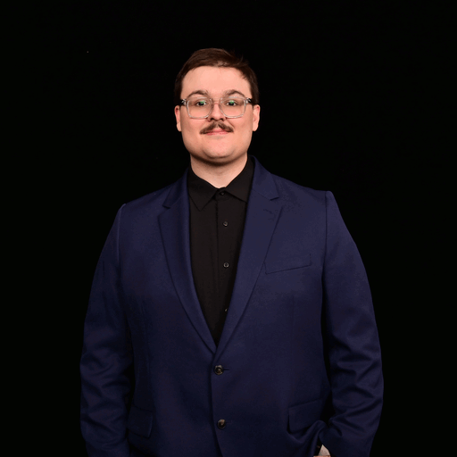

# Hi, I'm Nick 👋 

<!--[]-->
## Languages: C (Primary), C++,  Python, Java, VHDL(Verilog), Assembly, Typescript

  
<table width="100%" style="table-layout: fixed;">
<tr>
<td width="70%" valign="top">
  
## About Me
I’m a Computer Science & Engineering student at the University of Iowa (since 2023) with a strong interest in systems, embedded development, and hands-on engineering. I grew up tinkering with anything I could get my hands on, which led me from mechanical and robotics interests into computer engineering, where I found my passion in software and hardware integration.

In my free time, I run personal servers built from repurposed Dell Optiplex machines running Arch Linux, Windows, and headless Ubuntu setups. After taking Embedded Systems, I also began developing microcontroller projects and designing custom PCBs for IoT applications in everyday life.

Outside of engineering, I enjoy learning new things and immediately putting them into practice. I’m a dog person (cats are chill though), enjoy sandbox games like Teardown and Noita, and I’m a big movie fan. Current favorites, in order:

1. Bullet Train (2022)

2. Running Scared (1986)

3. Fantastic Mr. Fox (2009)

4. The Grand Budapest Hotel (2014)

  
<b>Contact:</b> n340028@gmail.com

</td>
<td width="30%" valign="top" align="center">
  

     
    <em>That's me!</em>
  

</td>
</tr>
</table>
